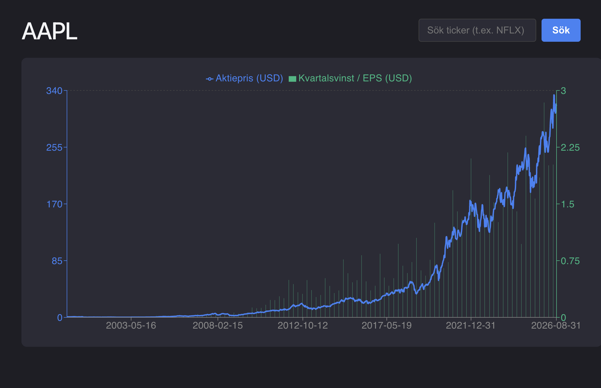

# StockAnalyzer 📈

En fullstack-applikation byggd med React och Spring Boot som visualiserar det fundamentala sambandet mellan ett företags aktiekurs och dess vinst per aktie (EPS) över tid. Inspirerad av Peter Lynchs investeringsfilosofi hjälper detta verktyg användare att snabbt identifiera om en aktie historiskt sett är över- eller undervärderad.

## Funktioner
*   **Sök & Hämta:** Hämtar realtids- och historisk aktiedata säkert via Alpha Vantages API.
*   **Datavisualisering:** Interaktiva och responsiva grafer byggda med Recharts som tydligt plottar aktiekurser mot EPS.
*   **Säker arkitektur:** Backend-drivna API-anrop som säkerställer att känsliga API-nycklar aldrig exponeras i frontend-koden.

## Teknikstack
*   **Frontend:** React, TypeScript, Recharts, Axios
*   **Backend:** Java, Spring Boot, Maven
*   **Externa API:er:** Alpha Vantage

### Förutsättningar
*   [Java 17+](https://www.oracle.com/java/technologies/javase-downloads.html)
*   [Node.js](https://nodejs.org/)
*   En API-nyckel från [Alpha Vantage](https://www.alphavantage.co/)

### Backend (Spring Boot)
1. Navigera till backend-mappen i din terminal
2. Kör klassen StockAnalyzerApplication. Spring Boot-servern startar nu på http://localhost:8080.

### Frontend (React)
1. Öppna en ny terminalflik och navigera till frontend-mappen
2. Installera alla beroenden: npm install
3. Starta utvecklingsservern: npm run dev

### Framtida förbättringar (Roadmap)
* Implementera caching i backend för att spara data tillfälligt och minimera antalet externa API-anrop. 
* Skriva enhetstester (JUnit) för att säkerställa den finansiella uträkningslogiken. 
* Driftsätta (deploya) frontend och backend till molntjänster.